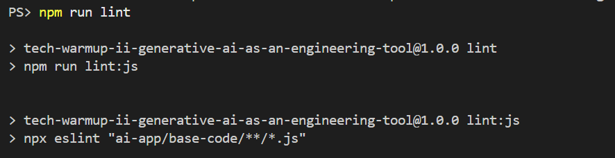

# Final Report: Building a Slot Machine with AI (Warmup II)

**Team:** SWEaters United

## 1. Introduction

This report details our team's process, findings, and learnings on using AI as an engineering tool to build a slot machine application. The goal of this exercise was to explore the interactions, challenges, and benefits of using AI in a software development workflow. We documented our entire process, from initial research and planning to final implementation and testing, to analyze how AI can impact software quality and engineering principles.

This document synthesizes our experiences in our [AI Plan](../ai-app/ai-plan.md) and [AI Use Log](../ai-app/ai-use-log.md).

## 2. Our Engineering Process with AI

This section describes our methodology working with AI in building a slot machine application.

### Initial AI Strategy
Our initial strategy was to follow a phased, incremental approach, building the application layer by layer. Before allowing Gemini to write any code, we wanted to load it with some context using our crafted user stories/personas and desired slot machine app (Phase 0). After this, we planned to start with the core JavaScript logic (Phase 1), then build the HTML structure (Phase 2), apply CSS styling (Phase 3), and finally add bonus features (Phase 4). Each step was intended to be a distinct task/component of the final slot machine app with a strong emphasis on validation and testing at each stage. The idea was to ensure a solid, tested foundation, which we viewed as a priority, before moving to more stylistic components.

### Evolved AI Strategy & Workflow
We quickly found that our initial strategy of developing the JavaScript logic in isolation first made debugging difficult, as we had no visual interface to see the results or interact with the code. We then tried developing multiple features at once to create a more complete application, but this introduced too many variables which Gemini couldn't properly handle at times; source of validation/linting issues, and core game logic/theme issues.

Our final, evolved workflow was a more balanced incremental approach. We focused on adding only one or two features per prompt, which created manageable and testable steps. We also refined our testing strategy to run unit tests primarily when JavaScript files were modified, ensuring our core logic remained while we built out the UI and styling. Whenever there were changes made to the HTML and CSS file, we manually validated them with W3C.

### Our Runs and AI Interactions
Our `ai-use-log.md` contains the 20 runs.

- **What Worked:**
  - **Priming:** Providing the AI with upfront context, rules, and constraints (Run 0) was initially effective. The AI adhered to these rules in subsequent prompts, going out its way to also make thorough unit tests too without prompting. However as we progressed, later runs seemed to follow these rules less (more validation/linting issues) perhaps because of the big prompts we gave it.
  - **Self-Correction:** The AI was capable of running linters and validators, identifying its own errors, and correcting them (Run 1, Run 3, Run 6). When provided with specific validator error messages, it could make precise fixes. It even installed its own packages with Node.js to support this.
  - **Changing Features:** The AI was able to change features successfully if we prompted it to. When we had issues with the core game logic (add gold button) or styling issues, Gemini was able to address these issues once we focused on a specific issue at a time. It was also able to recognize the location most of the times and giving it some brief context in the prompt beforehand also helped accelerate this process too.
  - **Reducing Complexity:** Our linter for this project checked for complexity of the code. Oftentimes the reason why our code did not pass the linter was because it was flagged as too complex. However, whenever we prompted it to address these issues, it was able to do so successfully.

- **What Didn't Work:**
  - **Overly Complex Prompts:** Asking the AI to generate a large, multi-part HTML structure in a single prompt resulted in validation errors (Run 5). Breaking down the request into smaller, more focused prompts was more effective.
  - **Lack of Visual Feedback:** Developing the JavaScript logic without a corresponding UI made it difficult to test and validate the application's behavior from a user's perspective. This led us to evolve our strategy to integrate UI development earlier.
  - **Simultaneous Styling and Structure:** We learned that it would have been more efficient to style components as they were created in HTML, rather than building the entire structure and then styling it all at once.
  - **Finding Valid Links to External Resources (sound):** Gemini had a hard time finding valid links to sound effects or music. One of the features we wanted to include in our slot machine to better enhance our medieval theme and user experience was to include sound components. Upon asking this, Gemini searched on Google "royalty free" medieval music and sound effects. It found links but all were invalid. This required a manual process of finding the sound components ourselves.
  - **Specific UI Positioning** A big issue our slot machine faced was aligning it properly on the browser screen, ensuring it could entirely be seen in the browser view as well as in the center. Many times it was just slightly positioned to the left and then upon addressing this in the prompt, it would be too much to the right afterwards. This was even further an issue when the browser size changed and the entire slot machine itself was displaced. We believe Gemini has a hard time with this kind of issue because it cannot "see" the produced app itself.

## 3. Results & Learning Outcomes

This section addresses the key learning goals of the exercise.

### The Importance of Research and Planning
Our initial research and planning phase was critical to the project's success. By defining user personas, feature requirements, and a clear theme (Medieval), we were able to create highly specific and focused prompts for the AI. This detailed planning ensured that the AI's output was aligned with our vision from the start, reducing the uncertainty of possible features or certain stylistic themes to to add later on. The `ai-plan.md` served as our roadmap, allowing us to maintain focus and consistency throughout the development process.

### Challenges of Using AI in Software Engineering
1.  **Prompt Specificity and Understanding:** Vague or overly broad prompts led to generic or incorrect output. We learned that the quality of the AI's output is directly proportional to the quality and detail of the prompt. For example, asking for a full HTML page at once (Run 5) failed validation, whereas asking for specific fixes (Run 6) succeeded. We also learned that Gemini often addresses the issues in the prompt sequentially. For example, if the prompt addresses linting issues first and later a feature that we wanted to change, Gemini would focus on the linting issues first and then changing the feature (vice-versa too). This intrinsically puts priority into certain places in our prompt that maybe undesired.
2.  **Validation is Non-Negotiable:** AI-generated code cannot be trusted blindly. We encountered validation errors in HTML and linting issues in JavaScript. A rigorous workflow that includes validation steps (using W3C validators, ESLint) is essential to ensure code quality and correctness.
3.  **Technical Debt:** While the AI could generate complex logic, debugging it required a solid understanding of the code. Without a visual interface, it was challenging to understand the state and behavior of the application, which highlighted the need for an iterative process that combines logic and UI development as well as manual/human input.

### The Future of AI in Our Team's Process
- We will likely continue to use AI as a tool for assisting our development process, particularly for generating prototypes and writing unit tests. Hearing its suggestions for well-defined features will also probably take place too.
- While in use, our process will likely incorporate a "priming/context loading" step (either in each prompt or beginning of a session) to ensure the AI is aligned with our goals and understands our problems/standards.
- Prompt engineering will become a core skill, with a focus on creating clear, specific, and context-rich prompts to guide the AI effectively. These prompts should balance specificity and breadth so that AI can still understand our high-level purpose and not be overloaded with many tasks at once in the context of our work.

## 4. Final Product Showcase

### Final Look

Here is the final appearance of our Medieval themed slot machine:

### Quality Assurance & Validation

Our project successfully passed all quality checks.

- **JavaScript Linting (ESLint):** All JavaScript code passed our strict ESLint rules, ensuring code quality, consistency, and readability.
  

- **Unit Tests:** The core logic of the application is covered by a suite of unit tests, all of which passed successfully.
  

- **HTML Validation (W3C):** The final HTML structure is fully compliant with W3C standards.
  

- **CSS Validation (W3C):** The stylesheet is valid according to the W3C CSS Validator.
  

