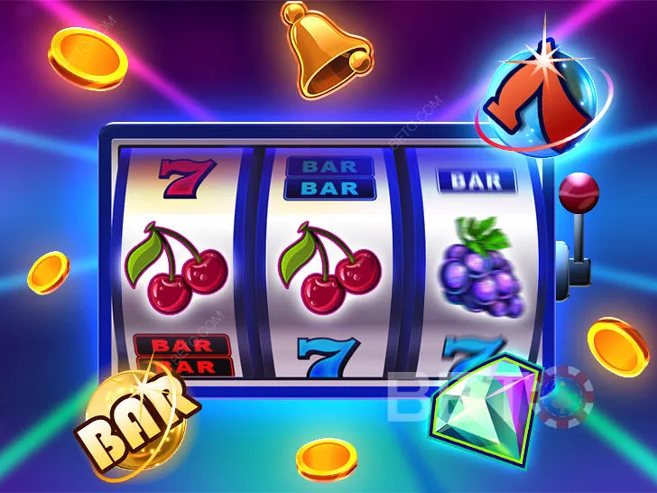
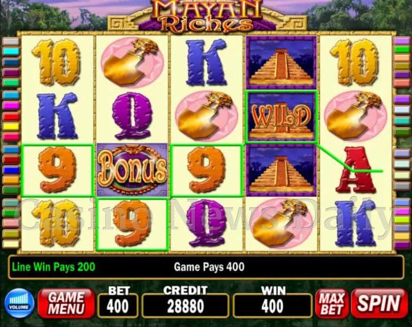
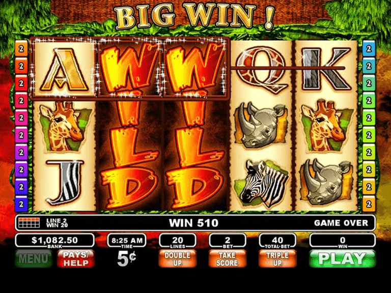
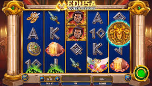
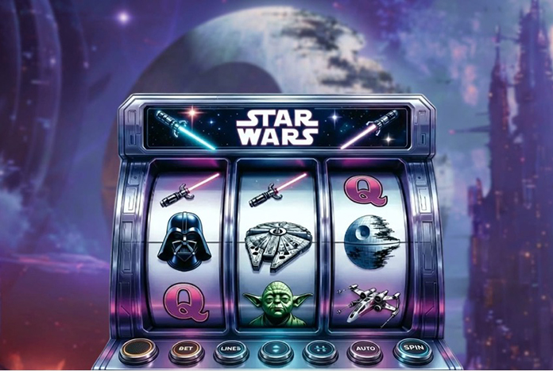

# Research Overview for AI Slot Machine (Warmup II)

## Research Summary

This document provides a summary of the initial research phase for the "Tech Warmup II: Generative AI as an Engineering Tool? — A De-Risk Activity for Using AI in an SWE Context". We gathered information on various aspects of slot machines, including their design, user experience, and technical components, that will help us in our development process of creating a slot machine of our own using AI. Research artifacts are located in the `raw-research`.

### Definition
*What is a slot machine?*

- Gambling machine that creates a game of chance for its customers
- A coin-operated (some form of currency) machine that generates random combinations of symbols on a dial where certain combinations wins varying amounts of money for the player

### History and Origin
*A brief timeline of the slot machine's evolution.*

- **Late 19th Century:** The precursor to modern slots emerged in the 1890s. Charles Fey's "Liberty Bell" (c. 1887-1895) simplified earlier complex machines with a 3-reel design and automatic payouts.
- **Mid-20th Century:** Innovations included the first "Jackpot" feature in 1916, payout multipliers in the 1950s, and the first fully electromechanical machine, "Money Honey," in 1963.
- **The Video and Digital Age:** The first video slot was developed in 1976. In 1996, WMS Industries introduced "Reel 'Em In," the first machine with a second-screen bonus round.
- **21st Century & Regulation:** The rise of online casinos prompted the Unlawful Internet Gambling Enforcement Act of 2006 in the US, which restricted banks from processing transactions with online gambling companies.

### Slot Machine Apps & Features
*Summary of common features, mechanics, and popular existing slot machine applications.*

- **Core Mechanics:** The core structure can be 3-reel (classic), 5-reel (modern standard), or grid/cluster-based (no traditional paylines). Paylines are lines where matching symbols result in a win and can be fixed or adjustable. Core symbols include standard low/high-value symbols, Wilds (substitute for other common symbols), and Scatters (trigger bonuses). Autoplay for consecutive spins is also a common feature. Levers back then served the purpose to actually roll the reels but now most slot machines are operated by buttons or are touchscreen.

- **Bonus Features:** These are special rounds or mechanics to enhance gameplay. Common examples include Free Spins (spins at no cost), Respin mechanics like "Hold and Win", interactive mini-games like "Pick and Click" or "Prize Wheels", and enhanced Wilds (Sticky or Expanding). Some games offer a "Bonus Buy" feature to directly access these rounds.

- **Monetization:** Monetization in social slot apps is primarily driven by In-App Purchases (IAP) for in-game currency. Other methods include Rewarded Ads (watch for rewards), VIP/Subscription models for premium benefits, and engagement hooks like Daily/Welcome bonuses to encourage player retention. Competitive Events/tournaments are also used to drive re-engagement.

### Feature Gap Analysis
*A summary of identified gaps and opportunities based on existing applications.*

- **User Experience Gaps:** Common complaints in existing apps suggest a need for affordable minimum bets, generous free play options, and better winning odds. Players also prefer when minimum bets are based on their level or bankroll rather than changing randomly.
- **RTP and Jackpots:** While the average RTP for mobile slots is ~95.5%, some popular games like *Mega Moolah* have a lower RTP (~88%) to fund massive progressive jackpots. This indicates a trade-off between frequent small wins and the chance for a huge prize.

### Jargon and Terminology
*Common terms used in the context of slot machines. [More](./raw-research)*

| Term | Definition |
| --- | --- |
| Volatility | Win frequency vs. size of payout (high volatile slot = infrequent pay but larger wins). |
| RTP (Return To Player) | The percentage of money that will be paid back to the player. |
| Payline | A line across the reels where matching symbols must land for a win. |
| Reel | A vertical column of symbols in a slot machine. |
| Scatter | A pay combination based on a certain symbol landing anywhere on the reels, rather than in a sequence |
| Free Spins | Form of bonus, where series of spins are auto-played at no charge. Typically for a combo of symbols. |
| RNG (Random Number Generator) | A system used to generate a sequence of numbers or symbols that cannot be reasonably predicted, ensuring fair and random outcomes. |
| Bonus | Rounds as part of a session that have bonus features depending on the game. Activated when certain symbols appear in a winning combination |
| Pay table | A table listing the number of credits a player will receive if the symbols listed on the table line up on the pay line |
| Wild symbols| These substitute for most other symbols in the game similar to a joker card |
| Optimal play | A payout strategy based on a gambler using the optimal strategy in a skill-based slot machine game |
| Cascading Reels |Game style where symbols fall/shift/disappear and allow other ones to fall/shift/appear in their place, causing multiple wins |
| Max Bet| Highest allowed bet per turn/overall |
| Min Bet| Lowest allowed bet per turn/overall

### Regulations
*A summary of common regulations for slot machines and gambling applications.*

- **RNG Certification:** Machines must use a certified Random Number Generator (RNG) to ensure fair and unpredictable outcomes.
- **Minimum RTP:** Most regulations require a minimum Return To Player (RTP), typically around 75%, that must be paid back to players over time.
- **Spin Speed:** A minimum spin duration (e.g., 2.5 seconds) is often enforced to prevent rapid, excessive wagering.
- **Geofencing:** Mobile apps must use geofencing to ensure they are only accessible in jurisdictions where online gambling is legal.
- **Know Your Customer (KYC):** Operators must verify a player's identity, age, and address before allowing them to deposit or withdraw funds.
- **State Gaming Boards:** Most states have gaming control boards that heavily regulate slot machines. Nevada is the notable exception with fewer restrictions.

### Visual Themes
*Common visual themes for the slot machine.*

- Classic/Retro (fruits, bars)

- Ancient Civilizations (Egypt, Greece, Aztec)

- Nature and Animals (buffalo, jungle)

- Fantasy/Mythology (Norse gods, dragons)

- Pop Culture (TV shows, movies, music)

### User Personas
*Potential users for slot machine applications. [More](./persona-documents.md)*

**Name:** Bobbert

**Age:** 23

**Occupation:** Investment Banker

**Location:** New York City

**Bio:** Bobbert is a recently graduated student who just got a new job as an investment banker. He is young and his family is middle-high income so money has never been a concern for him. He likes to party and wants excitement even if what gives him that excitement may not be good/healthy for him.

**Goals:** Climb the corporate ladder and become a wall street trader who hits it big. Wants to make as much money as possible with the least amount of effort in the long run. Is willing to put in work short term in the hopes of achieving this ideal long term goal. Wants to be ahead of the game when it comes to trends so is more likely to try new things.

**Dislikes:** He dislikes what a majority of people dislike. He bases his opinions heavily on public perception and generally doesn’t think for himself when making purchases. He doesn’t like the feeling of odds being stacked up against him and will quit easily if things get tough. Is not mathematically inclined. While he doesn’t admit it he truly thinks he is different and doesn’t like being called average.
(Contribution: Gurnoor Bola)

---

**Name:** William Shakespeare

**Age:** 41

**Occupation:** Writer

**Location:** Stratford-upon-Avon, United Kingdom

**Bio:** Shakespeare is a middle aged man who does a lot of writing in his free time. Being as good as he is comes with a lot of pressure so he looks for ways to take the edge off.

**Goals:** Winning is not the main driver here, although greatly appreciated. Shakespeare likes the thrill of gambling, the fancy animations, the stakes being high and being able to compete in something that he doesn’t have to think much about. Just something to retreat too when the writing gets to his head.

**Dislikes:** He’s an impatient guy, so waiting for stuff will drive his interest off elsewhere, he also doesn’t like when his user data is tracked.

### User Stories
*Stories of our potential users describing their connection to slot machines. [More](./user-stories.md)*

- As a **player who just won a jackpot**, I want **to easily share my win to my friends** so that **I can show off my achievement.**
- As a **professional gambler**, I want **a history of my previous spins easily available** so **that I can audit my spending and verify there were no glitches, and play the odds.**
- As a **responsible gamer**, I want **to set daily or weekly deposit limits during signup** so that **I can manage my budget effectively from day one.**
- As a **skeptical gambler**, I want **the odds to be verifiable and backed by the IRS** so that **I know I have a chance at winning.**
- As an **avid gambler**, I want **a lot of themes to switch between** so that **I do not get bored after playing one theme for too long.**
- As a **new player**, I want **an interactive tutorial when I first open the app** so that **I understand how the slot machine works before spending any money.**
- As a **player who has lost a lot in a session**, I want **the app to detect unusual spending patterns and prompt me with a cooldown or break reminder** so that **I don't make impulsive decisions.**

### Odds/Payout Specifics

- Gaming machines must have a return of between 85% and 92% over their lifetime. This means that for every dollar bet on a gaming machine, between 85 and 92 cents is returned to gamblers over time (casinos set the upper limit on the return to players).

- The truth is, with gaming machines you only have around a 1 in 7,000,000 chance of winning the top prize (playing maximum lines, ways or patterns).

## Team Roster and Contributions

| Team Member | Contribution |
| --- | --- |
| Abdurrahman Syed | Researched user odds/payout specifics|
| Andrew Le | Researched history and origin.  |
| Andre Stransky | Researched terminology |
| Gurnoor Bola | Researched user perspectives/persona. |
| Jason Wang | Researched history/origin, feature-gap analysis, and definition. |
| Justine Le | Researched user perspectives/stories. |
| Mani Schabani-Qassri | Researched user perspectives/persona/stories.  |
| Paul Montal | Researched terminology, and regulations.  |
| Sahil Dalal  | Researched regulations, user stories, terminology, and features. |
| Scott Pham| Researched terminology, features, and user stories. |
| Sophia Ali  | Researched feature gap analysis. |

## Research Artifacts and More Details

- **Raw Research Documents:** All detailed research files with extra case studies, sources and specific contributions can be found in the [raw-research](./raw-research/) notably the *Slot Machine Research* pdf file.
